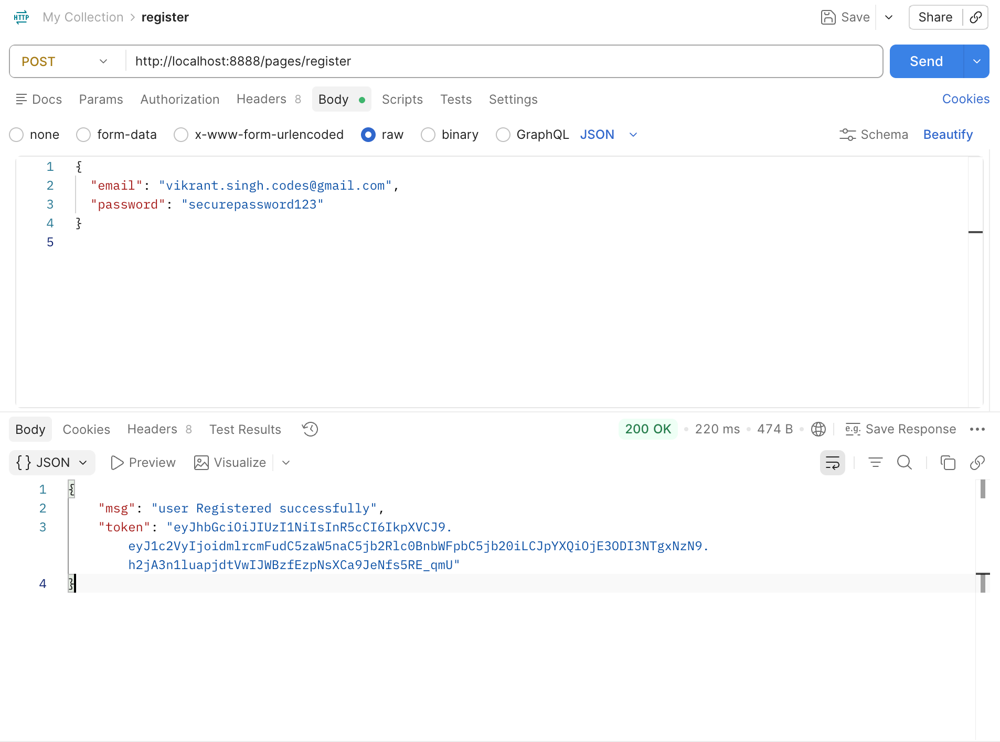
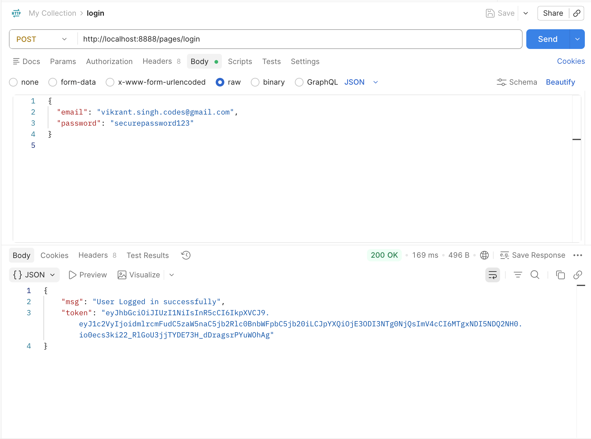
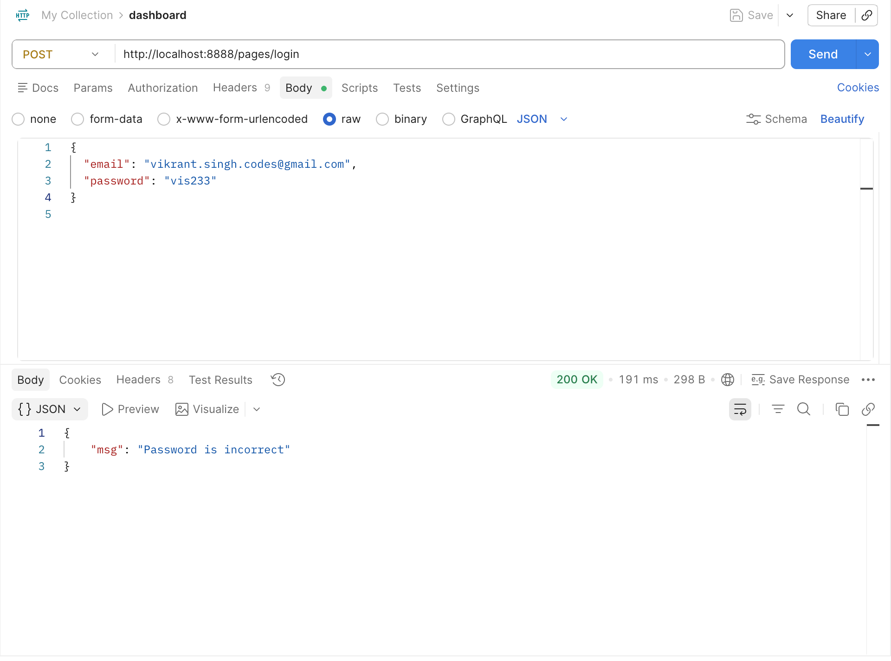
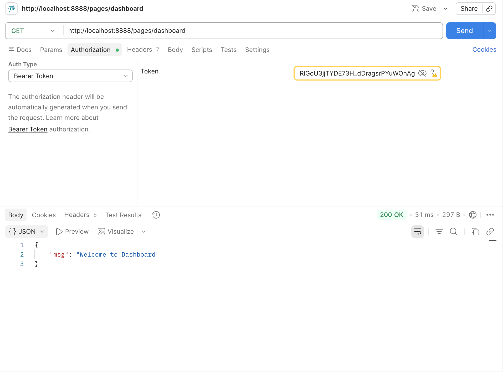
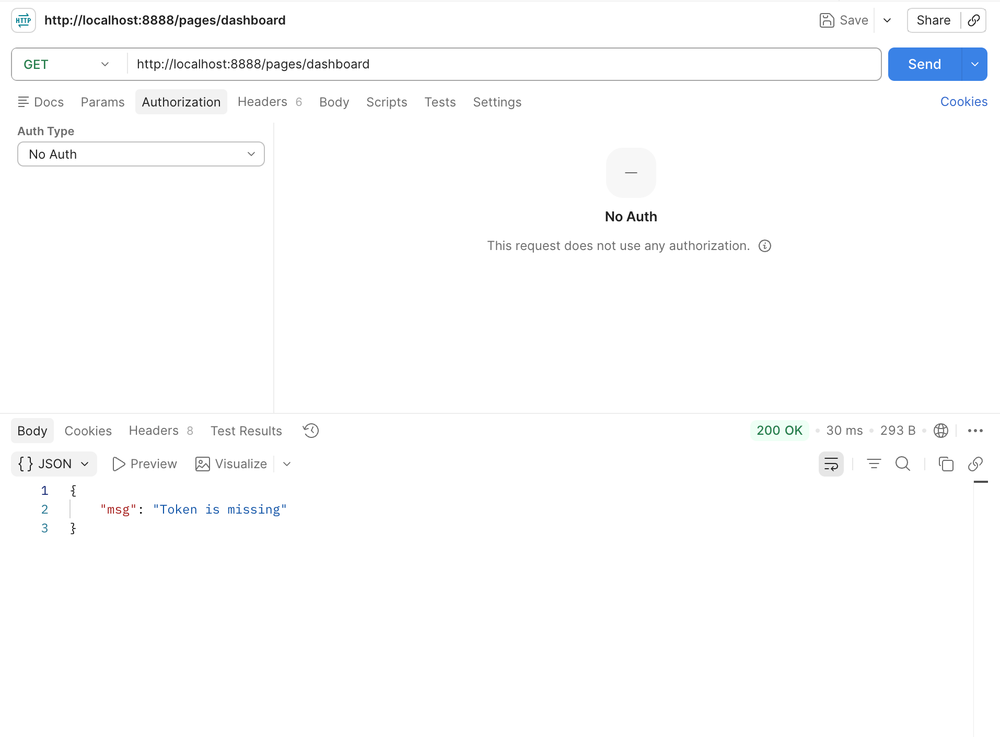
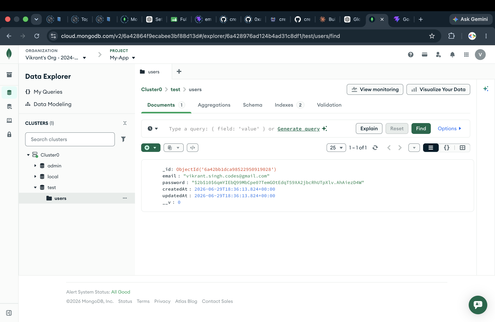

# Full Stack Authentication API & Frontend

This project fulfills all the requirements for the **Authentication API (Login & Signup)** assignment. It features a fully secure Node.js/Express backend and a beautiful, Tailwind-powered React frontend.

## 🚀 Assignment Requirements Completed

All requirements from the assignment prompt have been successfully implemented:

- [x] **Create Signup & Login APIs**: Fully functioning `POST /pages/register` and `POST /pages/login` endpoints.
- [x] **Hash passwords using bcrypt**: User passwords are securely hashed using `bcrypt` (with a salt round of 10) before being stored in the database. Password validation is done using `bcrypt.compare` during login.
- [x] **Generate & verify JWT tokens**: Upon successful login or registration, a secure JWT is signed using the `.env` secret. Protected routes verify this token using a custom authentication middleware.
- [x] **Token expiration**: Tokens are generated with a `365d` expiration.
- [x] **Configure CORS & dotenv**: The backend securely manages environment variables via `dotenv` and handles cross-origin requests via the `cors` package.
- [x] **Store user data in MongoDB**: Fully integrated with MongoDB using `mongoose`.
- [x] **Protected Routes**: The `/pages/dashboard` endpoint requires a valid JWT Bearer token to be accessed.
- [x] **Email uniqueness check**: The registration API verifies that an email does not already exist in MongoDB before creating a new user, returning a `400` level message if it does.
- [x] **Logout functionality**: Implemented securely on both the frontend (clearing `localStorage` tokens) and backend (logout API route).

## 📸 Screenshots

Here are the API test results and Database views:

### 1. Register Success


### 2. Login Success


### 3. Login Incorrect Password


### 4. Dashboard Access (With Token)


### 5. Dashboard Access (Without Token)


### 6. MongoDB Atlas Users Collection


## 🛠 Tech Stack

**Frontend:**
- React (Vite)
- Tailwind CSS
- Framer Motion (for smooth animations)
- Lucide React (Icons)
- React Router DOM

**Backend:**
- Node.js & Express.js
- MongoDB & Mongoose
- JSON Web Token (JWT)
- Bcrypt (Password Hashing)
- CORS & Dotenv

## 🏃‍♂️ How to Run

1. **Start the Backend:**
   ```bash
   cd Login-signup-backend
   npm install
   npm run dev
   ```
   *The backend will start on `http://localhost:8888`.*

2. **Start the Frontend:**
   ```bash
   cd Login-signup-frontend
   npm install
   npm run dev
   ```
   *The frontend will start on `http://localhost:5173`. Open your browser to test the auth flow!*
